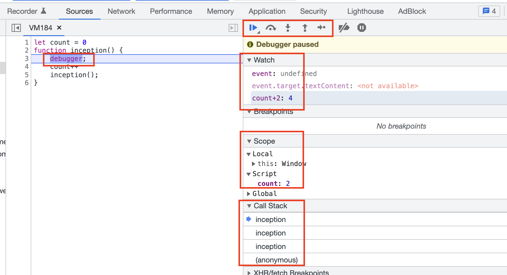
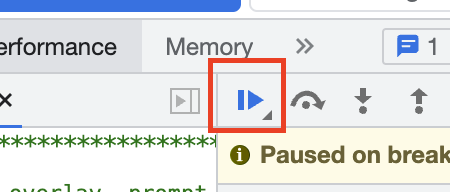

코딩하면서 예상치 못한 결과가 나왔을때 어디서부터 잘못된건지 궁금해질 때가 있다.  
그때 사용하면 유용한게 `Debugger`이다.  

- 브라우저의 `source탭`에서 코드라인을 클릭하면 중단점이 활성|비활성 된다  
- 에디터에서 `debugger;` 를 입력해서 중단점을 설정할 수도 있다  
- 각 버튼마다 다음라인 이동, 함수로진입, 빠져나가기 등 기능이 있다  
- Scope 탭의 script에서 선언된 변수들의 현재 값을 확인할 수 있다    
- Watch탭에서는 알아보고 싶은 변수를 입력해, 값을 확인해 볼 수 있다  
- Call Stack 탭에서 어떤함수들이 실헹되고 있는지 확인할 수 있다  
- 중단점 설정 후 재실행시키면 중단점에서 멈추는것을 확인할 수 있다  

> 중단점에서 뒤로 더이상 진행시키고 싶지 않을 때는 재생모양의 버튼을 오래 누르고, 중지모양의 버튼을 누르면 된다  

