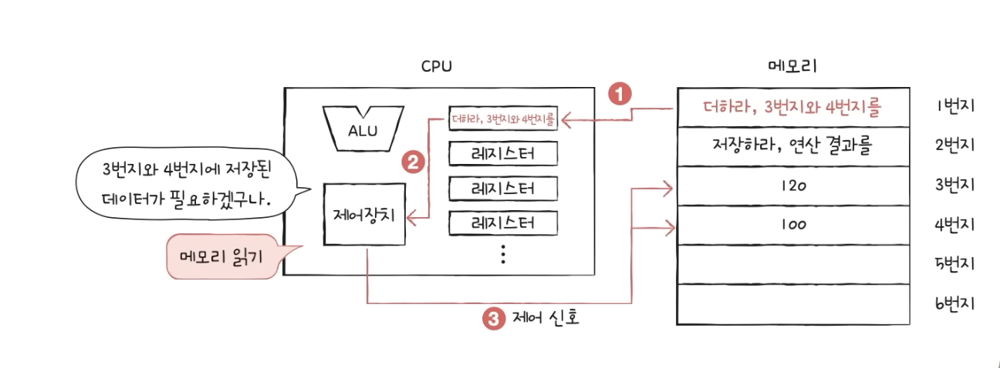
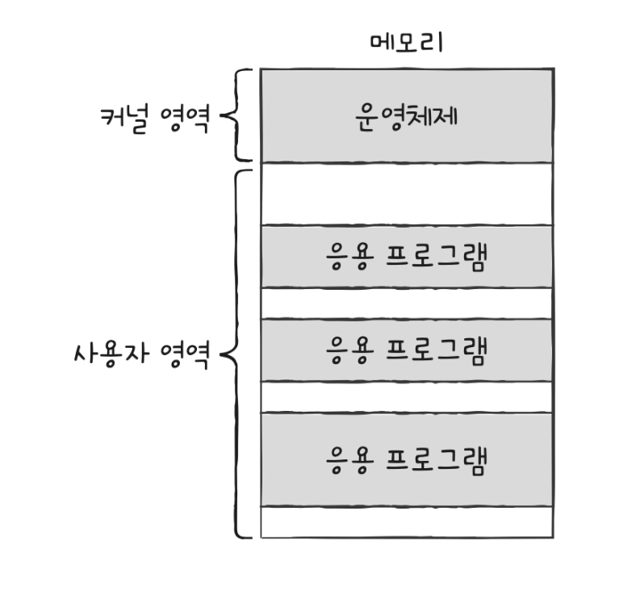

## Computer Architecture

컴퓨터의 근간, 즉 컴퓨터 구조를 알아야 `성능, 용량, 비용`이 고려된 프로그램을 짤 수 있다

컴퓨터 구조를 모른다면 문제의 인식력이 떨어지게 된다(컴구조를 안다면 미지의 대상에서 분석의 대상으로 바라볼수 있다)

### 1. 컴퓨터가 이해하는 정보

`데이터`와 `명령어` → 컴퓨터는 ‘명령어를 처리하는 기계’(데이터는 재료)

### 2. 컴퓨터의 네가지 핵심 부품

`CPU`, `메모리`, `보조기억장치`, `입출력장치`
> CPU: 컴퓨터의 머리  
> 메모리: 책상  
> 보조기억 장치(HDD, SSD): 창고  
> 입출력 장치: 눈코입  
> -> 위 부붐들을 메인보드라고 하는 판에 끼우면 컴퓨터가 된다.

### 1. CPU  
메모리에 저장된 명령어를 읽어들이고, 해석하고, 실행하는 부품이다.  
CPU는 데이터를 따로 저장하지 않기 때문에 데이터를 연산하거나 처리하려면 저장된 데이터를 CPU로 보내줘야 한다. 이 때 CPU는 창고 역할을 하는 기억장치인 HDD, SSD 에 신호를 보낸다. 그런데 창고는 워낙 커서 필요한 데이터를 찾기까지 시간이 오래 걸린다. 이렇게 될 경우 CPU가 보조기억장치를 기다리게 되어서 속도가 느려지기 때문에 메모리라는 작업공간을 두고 데이터뭉치를 한번에 가져와 작업하게됨으로써 시간이 많이 단축시킨다.  
프로그램을 실행시켰을때 로딩되는 과정이 프로그램 실행을 위한 데이터뭉치가 메모리로 올라가고 있는것이다.  
내부는 `ALU`(계산기), `레지스터`(CPU 내부의 작은 임시저장장치), `제어장치`(컴퓨터 부품을 작동시키는 제어신호를 내보내고, 명령어를 해석하는 장치)로 구성되어 있다  
제어장치(control unit)에 의해 메모리에 저장된 명령어와 데이터들이 레지스터에 임시 저장되고 실행된다

    
### 2. 메모리  
현재 실행되는 프로그램의 명령어와 데이터를 저장하는 곳  
프로그램이 실행 되려면 메모리에 저장되어있어야 하고, 실행중인 프로그램을 `프로세스`라고 한다  
내부 주소에 명령어와 데이터가 저장되어 있다  
전원이 꺼지면 저장된 내용을 잃는다(휘발성)  
### 3. 보조기억장치  
전원이 꺼져도 보관될 프로그램을 저장하는 부품이다  
실행되지 않은 프로그램들이 저장되어 있다.  
메모리는 실행할 정보를 저장하고, 보조기억장치는 보관할 정보를 저장한다  
### 4. 입출력장치  
컴퓨터 외부에 연결되어 컴퓨터 내부와 정보를 교환할 수 있는 부품이다  
모니터, 키보드, 마우스 ...

### 메인보드 & 시스템 버스  

메이니보드에 연결된 부품은 버스를 통해 정보를 주고받음  

버스는 컴퓨터 부품끼리 정보를 주고받는 일종의 통로  

`시스템 버스`는 컴퓨터의 핵심 부품을 연결하는 통로, `주소버스`, `데이터버스`, `제어버스`로 이루어져 있다    

주소버스는 메모리 위치 정보를 다루고, 데이터버스는 데이터, 제어버스는 명령어를 다루는 버스이다.
## OS  

우리는 프로그램을 실행할 때 위의 과정들을 직접 하지는 않는다. 어떤 소프트웨어가 하드웨어들을 대신 관리해 주는데 이것이 바로 `운영체제`(Operating System)이다. 대표적으로 PC에서 쓰이는 `Windows`, `Linux`, `macOS`, 모바일에서 쓰이는 `IOS, Android`가 있다.

윈도우를 만든 마이크로소프트, 맥과 ios를 만든 애플, 안드로이드를 만든 구글의 정책은 개발자들의 삶에 큰 영향을 미치게 된다. 왜냐하면 각 운영체제에서 돌아가는 프로그램을 만들기 위해서는 그들이 지정한 언어를 써야하는 경우가 있기 때문이다.

운영체제의 종류가 훨씬 다양했던 과거에는 개발자들이 배워야 하는 언어도 많았고, 프로그램도 다양한 운영체제에 맞게 만들어야 했다. 문제는 버그를 수정하고나 기능을 추가하는 경우 같은작업을 여러번 해야해서 할일이 기하급수적으로 늘어났었다. 하지만 자바를 만든 팀은 각 운영체제 위에 JVM(Java Virtual Machine)이라는 소프트웨어를 만들어서 JVM위에서 자바 언어로 만든 프로그램이 돌아갈 수 있게 만들어서 그 문제를 해결했다. 파이썬도 같은 방식을 사용하는데 단점으로는 속도가 느리다. 운영체제 위에 프로그램을 올리고 그 위에 또 프로그램을 올리기 때문이다. 현재 특히 모바일은 과거보다 JVM과 같은 컨셉에 대한 니즈가 적다. IOS와 안드로이드가 시장을 양분하고 있기 때문에, 프로그래밍 언어 2개만 알면 되거나 2명이 같이 하면되기 때문이다.

- 컴퓨터 자원들을 관리하는 특별한 프로그램, 실행중인 프로그램(프로세스)을 관리하는 특별한 프로그램

- 개발자가 만드는 프로그램들이 운영체제에 의해 관리되기 때문에 운영체제에 대한 지식이 필요하다

- 자원과 프로그램들 사이의 문지기 역할을 한다

## 0과 1로 숫자를 표현하는 방법
- 비트: 0 과 1로 표현하는 가장 작은 정보단위(하나의 비트로 2가지의 정보를 표현 가능)  
- n개의 비트로는 2^n개의 정보를 표현 가능  
- 보통 비트보다 더 큰 단위를 사용한다(byte, kB, MB, GB...)  

|||
|------|---|
|1 byte|8 bit|
|1 kB|1,000 byte|
|1 MB|1,000 kB|
|1 GB|1,000 MB|
|1 TB|1,000 GB|

**워드:**  CPU가 한번에 처리할 수 있는 정보의 크기단위

## 이진법(binary)
- 0과 1로 수를 표현하는 방법
- 숫자가 1을 넘어가면 자리올림 한다
- 이진수 표기시 앞에 ob를 붙인다(`ob`1000)

### 음수 표기법
- 어떤 수를 그보다 큰 2^n에서 뺀 값  
=> 0을 1로, 1을 0으로 바꾼뒤 1을 더한다.
- 양수 ob0101과 음수 ob0101은 서로다른 flag를 가지고 있어서 CPU에서 구분할 수 있다.

## 16진법(hexadecimal)
- 이진법으로는 숫자의 길이가 너무 길어진다
- 15가 넘어가는 시점에 자리올림  
- 16진수 표기시 앞에 ox를 붙인다(`ox`00ffffff)
- 2진수와 16진수간의 변환이 간편하다
- 하나하나가 `4비트`

| 0 | 1 | 2 | 3 | 4 | 5 | 6 | 7 | 8 | 9 | 10 | 11 | 12 | 13 | 14 | 15 | 16 | 17 |
|---|---|---|---|---|---|---|---|---|---|---|---|---|---|---|---|---|---|
| 0 | 1 | 2 | 3 | 4 | 5 | 6 | 7 | 8 | 9 | A | B | C | D | E | F | 10 | 11 |