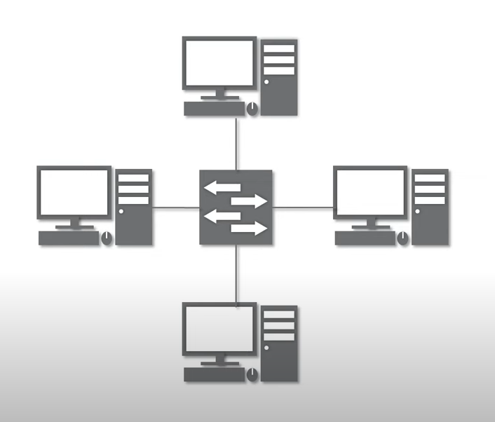
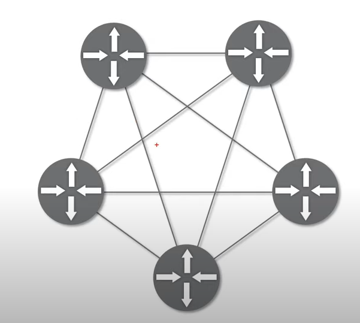

# 네트워크란?

노드(네트워크에 속한 컴퓨터, 통신장비)들이 데이터를 공유할수 있게 하는 `디지털 전기통신망`의 하나이다.  

분산되어있는 컴퓨터를 통신망으로 연결해, 서로에게 데이터를 교환할 수 있도록 한다. 자주 사용하는 `인터넷`은 네트워크의 한 종류이다.   

### 인터넷

- 문서, 그림, 영상과 같은 데이터를 공유할수 있도록 구성된 세상에서 가장 큰 네트워크  

- WWW(World Wide Web)은 인터넷을 통해 웹과 관련된 데이터를 공유하는것   

# 네트워크의 분류[크기]

## 1. LAN(Local Area Network)

- 가까운 지역을 하나로 묶은 네트워크  

- 같은 PC방에서 LAN을 통해 게임을 같이 할 수 있다  

- 랜선은 길어질수록 구리선의 저항이 커지기 때문에 가까운 거리에 적합하다  

## 2. WAN

- 멀리 있는 지역을 하나로 묶은 네트워크  

- LAN들을 하나로 묶는것  

- 장거리 네트워크를 연결하기위해 굵은 케이블을 해저를 통해 연결한다  

- 우리집 LAN과 구글의 LAN이 연결되어있기 때문에 구글 웹페이지(서버)에 접속 가능  

## 3. MAN, VLAN, CAN, PAN...

# 네트워크의 분류[연결 형태]

어떤 네트워크 장비에 연결되어있나에 따라 구분가능  

## 1. Star

- 중앙장비에 모든 노드가 연결됨  

- 가정집에서 일반적으로 보여짐, 중앙의 공유기가 고장나면 모든 기기가 오프라인 상태가 된다  

  

## 2. Mesh

- 여러 노드들이 서로 그물처럼 연결됨  

## 3. Tree, Bus, Ring...

# 네트워크 통신방식

## 1. Unicast

- 특정 대상과 1:1로 통신  

- 수업시간에 특정 학생에게 질문  

## 2. Multicast

- 특정 다수의 대상과 통신  

- 수업시간에 특정 분단에게 질문  

## 3. Broadcast

- 네트워크상 모든 대상과 통신  

- 수업시간에 전체 교실에 질문  

# 네트워크 프로토콜

네트워크에 있는 특정한 사용자에게 데이터를 전송하기 위해 `정해진 양식`에 데이터를 실어 보낸다.  

네트워크에서 노드와 노드가 통신할 때 어떤 데이터를 어떻게 보내는지 작성하기 위한 양식을 `프로토콜`이라 한다  

- 택배는 택배만의 양식  
- 편지는 편지만의 양식  
- 전화는 전화만의 양식  

이처럼 각 프로토콜도 해당 프로토콜 만의 양식을 갖고있다  

## 가까운곳

- Ethernet 프로토콜(MAC주소 사용)  

## 멀리 떨어진곳

- IP주소  
- ICMP  
- IPv4, IPv6  
- ARP  

## 다양한 프로그램

- 포트번호(페이스북에서 보낸 메세지가 카톡에 뜨지 않는 이유)  
- TCP, UDP  

### ⇒ 실제로는 여러 프로토콜을 같이 사용, 프로토콜이 모여 캡슐화 된것이 `패킷`