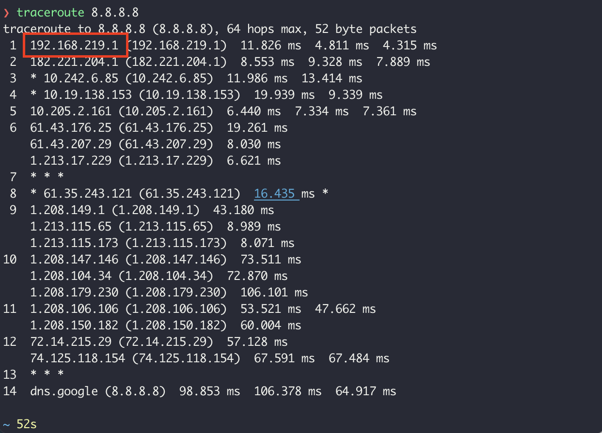
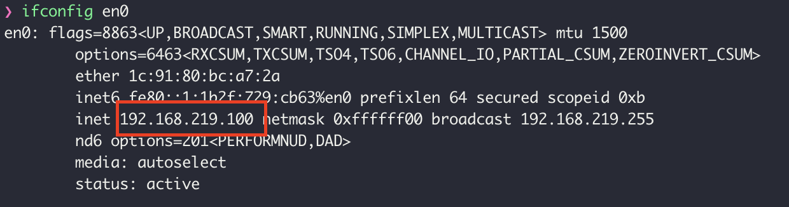
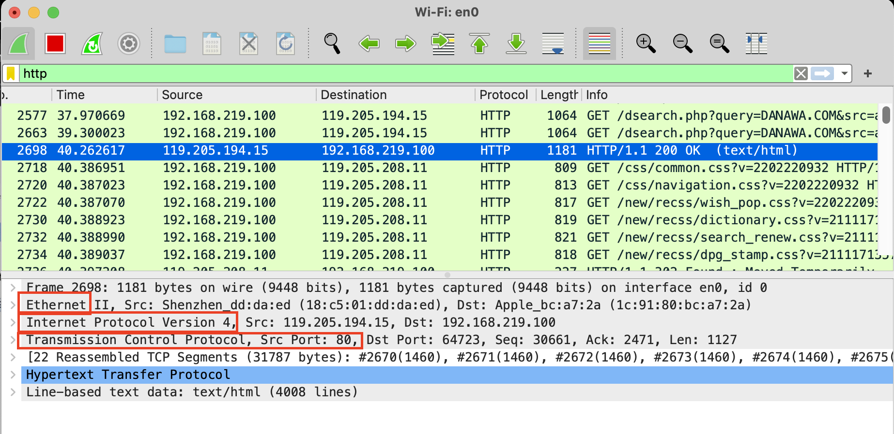

## 1. traceroute

네트워크 상에서 특정 노드(서버)와 내가 어떻게 연결되어 있는지 traceroute 명령어를 통해 확인할 수 있다  

- hops: 네트워크 대역, LAN들의 개수, 보통 15hops안으로 전세계가 연결되어 있음  
- 1번 hop: 우리집의 공유기(LAN)  

- \* \* \*로 표기되는 LAN은 방화벽 등으로 보호되어 정보공유를 하지않지만, hop으로서의 역할은 하게된다  

## 2. wireshark

네트워크 통신 시 프로토콜을 캡쳐해서 확인할 수 있게 도와주는 프로그램  

웹사이트 접속 후, `HTTP/1.1 200 OK` 에 사용되어진 프로토콜 확인  

- Ethernet: 가까운곳에서의 프로토콜  
- Internet Protocol Version 4(IPv4): IP를 통해 먼거리의 노드로 갈때 사용되는 프로토콜  
- Transmission Control Protocol(TCP): 포트를 통해 브라우저 프로그램과의 연결  

⇒ 네트워크 통신에 여러가지 프로토콜이 사용된다.  