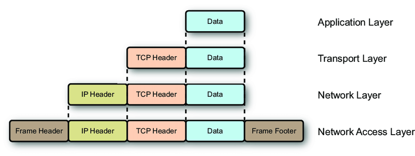
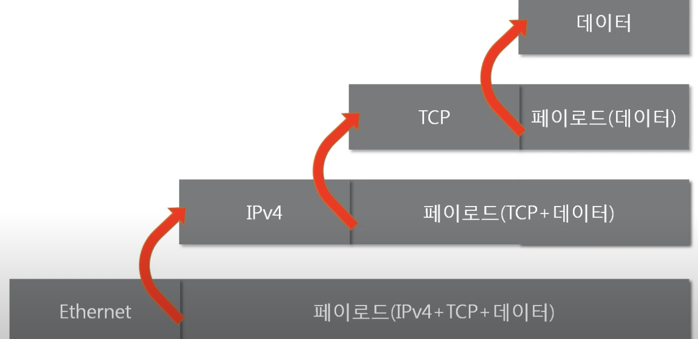
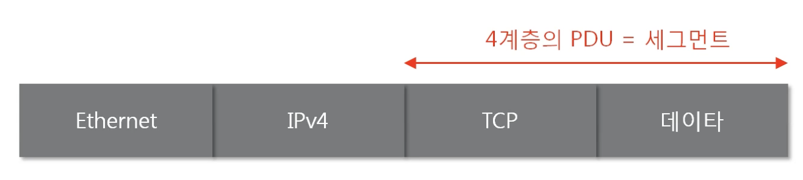

# 패킷: 네트워크를 통해 전달되는 데이터

- 패킷이란 네트워크 상에서 전달되는 블록형태의 데이터이다. 패킷은 `제어정보`와 `사용자 데이터`로 이뤄지며, 사용자 데이터는 `페이로드` 라고 한다.  
- 패킷은 여러 프로토콜의 조합으로 구성되어 있으며, 각 프로토콜은 러시아 인형처럼 바깥쪽, 안쪽의 프로토콜이 정해져 있다. ⇒ `캡슐화` 되어있다  

## 캡슐화(encapsulation)

여러 프로토콜을 이용해서, 최종적으로 보낼 패킷을 만드는 과정  

- 일반적으로 푸터는 쓰지않고 헤더만 사용, `이더넷`만 푸터를 사용(3계층 타입에 대한 정보)  

## 디캡슐화(decapsulation)

패킷을 받았을 때 프로토콜을 하나씩 확인하면서 데이터를 확인하는 과정  

- 캡슐화의 반대방향으로 진행된다  
    
    
    

### PDU(Protocol Data Unit)

계층별로 `패킷의 이름`이 다르다

- 4계층: 세그먼트  
- 3계층: 패킷(네트워크상의 패킷과 다른의미)  
- 2계층: 프레임  

