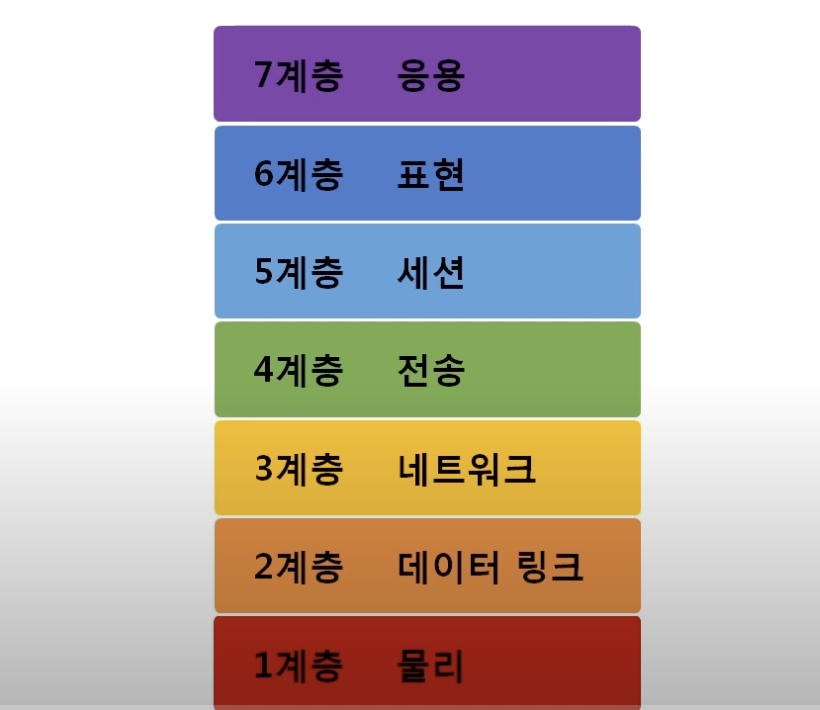
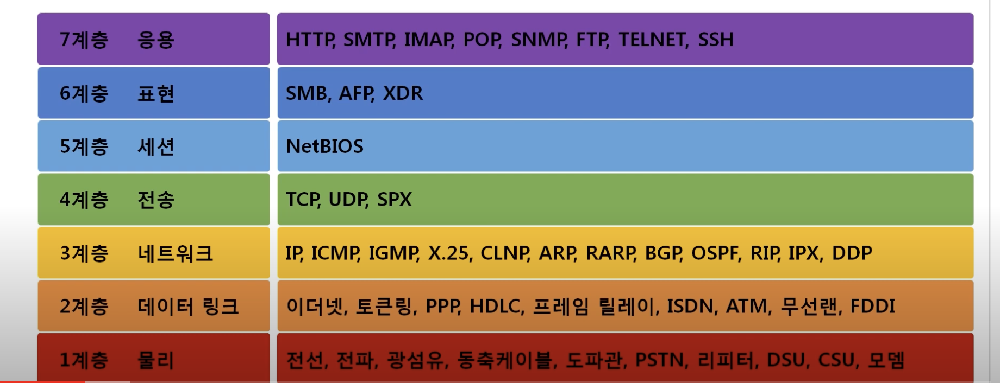

# 1. TCP / IP 모델

1960년대말 미 국방성의 연구로 시작되어 1980년대 초 프로토콜 모델로 공개.

현재 인터넷에서 컴퓨터들이 서로 정보를 주고받는데 쓰이는 통신규약(프로토콜)의 모음이다.

# 2. OSI 7계층

1984년 네트워크 통신을 체계적으로 다루는 ISO(International Standards Organization)에서 표준으로 지정한 모델, 데이터를 주고받을 때 데이터 자체의 흐름을 각 구간별로 나눠둠.

> 기술면접 등에서는 OSI계층이 더 자주 나온다

## OSI 7계층 모델의 계층별 프로토콜

> 주요 프로토콜: HTTP, TCP, UDP, IP, ICMP, ARP, 이더넷

## 공통점과 차이점

### 공통점

- 계층적 네트워크 모델
- 계층간 역할 정의

### 차이점

- 계층의 수 차이
- OSI는 역할기반, TCP/IP는 프로토콜 기반
실제로는 http 프로토콜 안에 표현에 대한 정보(사진인지, 텍스트인지)도 담겨있다.
- **OSI**는 `통신 전반`에 대한 표준, **TCP/IP**는 `데이터 전송기술`에 특화