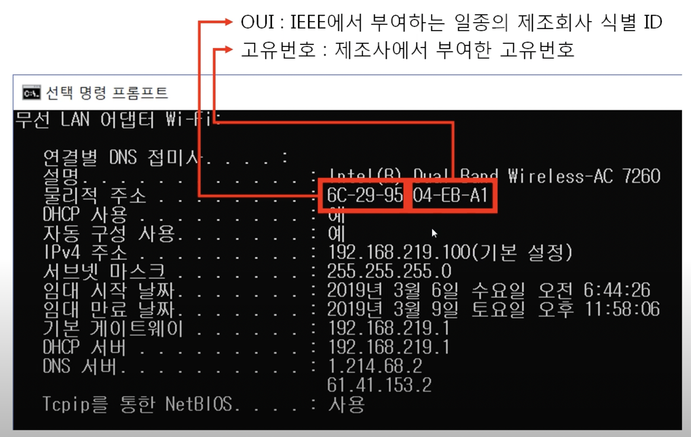
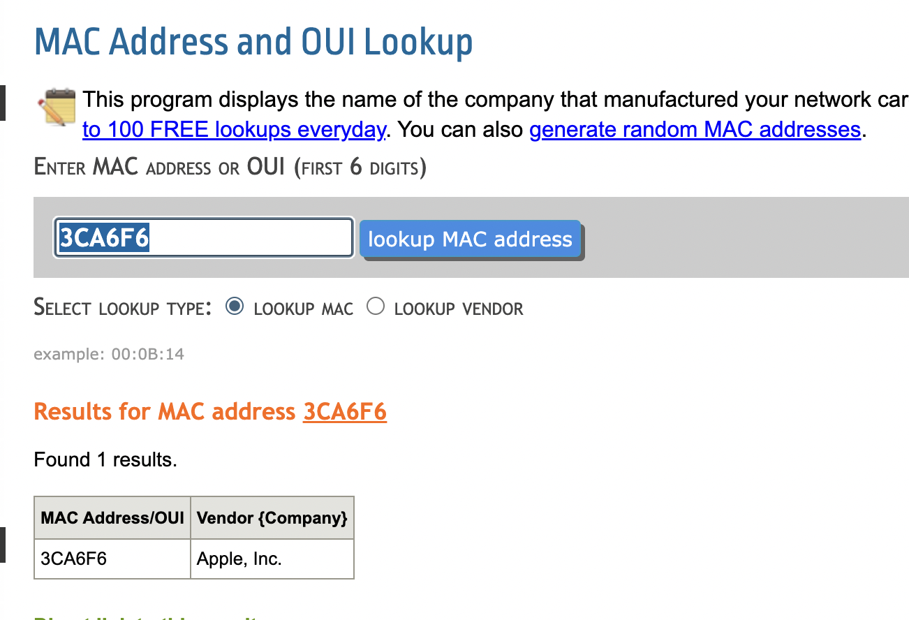

# 2계층의 기능

- 2계층은 하나의 네트워크 대역(LAN) 즉, 같은 네트워크 상에 존재하는 장비들간의 `데이터 전달`, `오류제어`, `흐름제어` 수행
- 2계층은 LAN에서 통신할 때만 사용된다. 다른 네트워크와 통신할 때는 3계층의 도움이 필요하다. 즉, 3계층의 `주소`와 `프로토콜`을 이용해야 다른 네트워크와 통신이 가능하다  
- 이더넷 프로토콜은 `LAN에서 갈수있는곳(게이트웨이)`까지만 적을 수 있기 때문에, 여러 네트워크를 이동하는 패킷의 경우 각각 네트워크 대역에서 사용 가능한 맥주소로 `새로 만들어 지게` 된다  

# 2계층에서 사용하는 주소

### MAC(Media Access Control **Address**)

- 물리적인 기기(컴퓨터, 핸드폰...) 고유번호
- 16진수로 되어있다. 12자리이기 때문에 6바이트이다.
- OUI: 제조회사 고유번호
- 고유번호: 기기자체의 고유번호

[여기](https://aruljohn.com/mac/3CA6F6)에서 OUI별 제조회사를 검색해 볼 수 있다

# 2계층의 프로토콜: Ethernet

## 주요구성요소

- Destination Adress: 목적지 MAC주소, 6바이트
- Source Address: 출발지 MAC주소, 6바이트
- Ethernet Type: 상위 프로토콜 타입, 2바이트, ipv4(0x0800), arp(0x0806)
0x는 16진수를 의미함