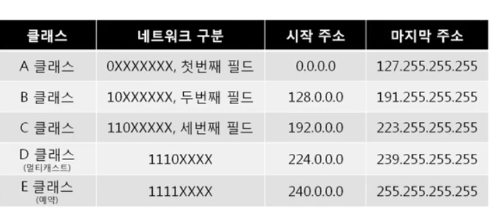
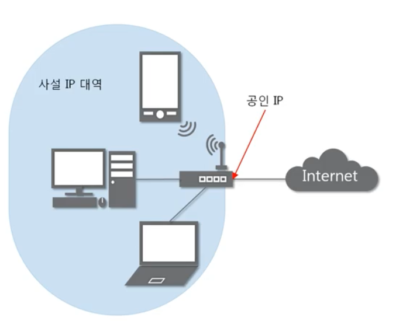

- 4개의 필드로 구성되어 있고, `.`으로 구분된다.  
- 4바이트  
- 10진수로 표기된다(필드별 1바이트 = 8비트)이기 때문에 00000000 ~ 11111111 까지 표현가능하다. 십진수로는 0 - 256  

### 서브넷마스크

- 네트워크 대역을 나눠주는데 사용하는 값  

- 어디까지가 `네트워크 대역`을 구분하는데 사용되고, 어디부터 `호스트`를 구분하는데 사용하는지 지정  

- 2진수로 표기했을때 1로시작, 1과 1사이에는 0이 올 수 없다는 규칙을 가지고 있다  

```jsx
// Example
// 1과 0이 구분되는곳이 서브넷마스크이다
255.255.255.192 => 11111111.11111111.11111111.11000000
```

```jsx
- 서브넷팅: 네트워크를 잘게 나누는것
- 슈퍼넷팅: 나눠진 네트워크를 합치는것
```

## 1. Classful IP주소(낭비가 심함)

- 클래스별로 고정되는 자리수가 변한다  
- 앞에 고정되는 필드는 `네트워크 대역` 을 구분하는데 쓰이고, 나머지 필드는 `하나의 네트워크 내에서 장비를 구분`하는데 쓰인다  

### A클래스

- 128개의 네트워크 대역 가능 ⇒ 너무적다

- 하나의 네트워크내 2^24 의 기기를 구분할 수 있다. 큰기관에서 씀

### B클래스

- 두번째 필드까지 네트워크 구분, 3-4필드 네트워크에 속해있는 기기 구분

### C클래스

- 세번째 까지 네트워크구분, 마지막 필드 256개의 기기 구분



## 2. Classless IP주소

- 낭비되지 않도록 아껴쓰는 주소체계

# Public IP와 Private IP



부족한 IP를 해결하기위해 `사설IP`와 `공인IP`라는 개념을 도입하게 된다

- Public IP: 외부 네트워크 대역에 연결된 IP주소
- Private IP: 같은 네트워크(LAN) 대역 에서 사용하는 IP주소

⇒ `공유기`가 요청과 응답을 `매칭`해 준다(NAT테이블에 기록)

⇒ 나간적이 없는 패킷은 공유기가 받고 내부로 전달하지 않는다 

⇒ 그래서 `서버`는 보통 `공인 IP`를쓰거나 `포트포워딩`을 사용한다

### NAT(network address traslation)

사설 IP에서 공인 IP로 네트워크 주소 변환

# 특수한 IP주소

### 0.0.0.0

`나머지` 모든 IP

### 127.0.0.1~4

자기 자신을 나타내는 주소

### 게이트웨이 주소

- 어딘가로 가기위해 일단 가야하는 주소(`공유기`의 IP)
- 정해져있지않지만, `가장 낮거나 높은 주소`를 사용하기로 약속
- 외부세상(네트워크)로 나가는 문
- 공유기 뒷면의 포트1개(WAN)는 좀 다르고 나머지(LAN)는 같다
- WAN에 공인 IP를 꽂는다

# 인터넷이 되려면 ?

### 1. 나를구분

- IP주소
- 서브넷마스크

### 2. 외부로 나가는 문

- 기본게이트웨이 : 나가는문을 설정하지 않으면 인터넷이 되지 않는다
- 추가로 DNS서버설정: 도메인으로 접속가능