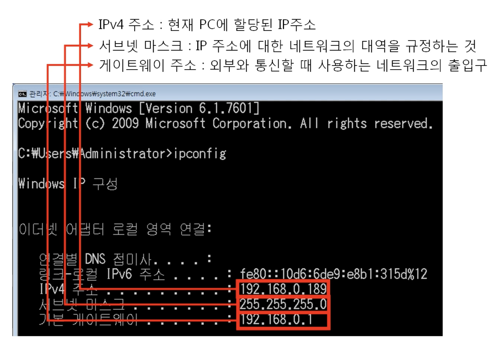

- 3계층은 멀리 떨어진 다른 네트워크(LAN) 대역까지 어떻게 데이터를 전달할지 제어하는 일을 담당한다.
- 발신에서 착신가지의 패킷의 경로를 제어한다
- 3계층 프로토콜이 WAN에서 사용하는 주소는 `IP주소`이다

# 3계층 프로토콜

## 1. ARP 프로토콜

IP주소를 이용해 MAC(기기 고유식별 번호)를 알아오는 프로토콜

## 2. IPv4프로토콜

WAN에서 통신할 때 주소로 사용됨

## 3. ICMP 프로토콜

서로 통신되는지 확인하는 프로토콜