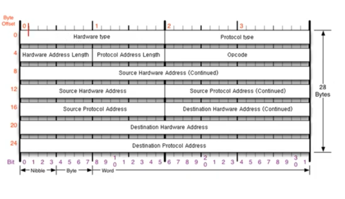

- 같은 네트워크 대역에서 IP주소를 이용해 `MAC주소`를 알아오는 프로토콜이다.  
- IP주소는 알고, MAC주소는 모르더라도 ARP를 통해 통신이 가능하다  
- 모든 네트워크시 선행된다  
- ARP 캐시테이블에 IP주소와 MAC주소를 저장한다  

```jsx
// CLI에서 확인하는법
arp -a
```



- Hardware type: 2계층 프로토콜 타입(Ethernet ...)  
- Protocol type: IPv4  
- opcode: 요청, 응답 구분  
- Source Hardware Address: 출발지 MAC주소  
- Source Protocol Address: IPv4 주소  

## 과정

1. ARP프로토콜의 목적지 MAC주소를 0으로 비워서 같은 네트워크 대역의 모든 장비에 ARP 요청을 보낸다(`브로드캐스트`)  
2. ARP를 받은 장비에서 decapsulation을 한뒤 3계층의 목적지 IP가 자신과 일치하면 MAC주소를 담아, ARP응답을 한다  