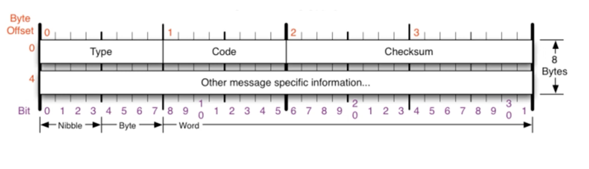

- 상대방과 통신이 되는지 확인하는 프로토콜
- 네트워크 컴퓨터 위에서 돌아가는 운영체제에서 오류메세지를 전송받는데 쓰인다
- 프로토콜 구조의 Type과 Code를 통해 오류메세지를 전송받는다

## 주요 Type

- Echo, Echo reply

연결상태 확인을 위한 응답과 요청

- Destination Unreachable

목적지에 도달하지 못함, 라우터 등 경로설정 문제

- Time exceed

요청시간 만료, 상대방의 문제(방화벽 등)

- Redirect

원격지의 라우팅 테이블 수정