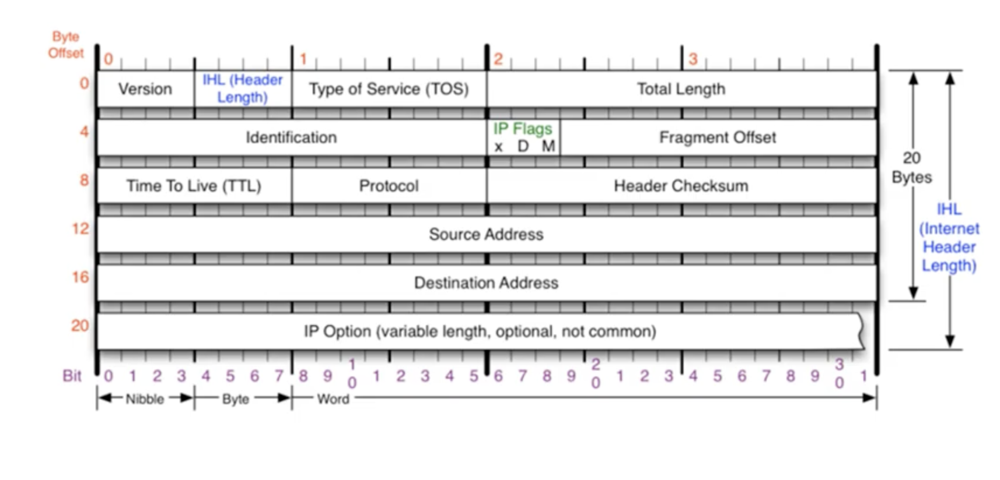

- 장거리의 네트워크 상(WAN)에서 데이터를 교환하기 위한 프로토콜
- `데이터가 정확하게 전달될 것을 보장하지 않는다`
- 중복된 패킷을 전달하거나, 패킷의 순서를 잘못 전달 할 가능성도 있다(악의적으로 이용되면 Dos 공격이 됨)
- 데이터의 정확하고 순차적인 전달은 상위 프토코톨인 `TCP`에서 보장한다

- Version: 4로 고정된값, IPv6는 프로토콜 자체가 다름
- IHL: 헤더의 길이(20-60)를 4로 나눈 값
- Identification: 쪼개진 네트워크 패킷조각 들이 같은 데이터임을 표시하는 식별자
- IP Flags: M(more fragment)만 사용됨, 최대 전송 단위 이상이면 자동으로 1로 설정
- Fragment Offset: 패킷 조각의 순서를 구분(받는쪽에서는 순서가 보장되지 않음)
- TTL: 패킷이 살아있을 수 있는 시간(오전송된 패킷이 계속 살아있고, 누적되면 Dos공격과 같이 될 수 있음), 운영체제 마다 설정값이 다르기 때문에 TTL값을 통해 `서버 OS`를 추측 가능
- Protocol: 상위프로토콜에 대한 정보 ex) ICMP, TCP, UDP
- Header Checksum: 헤더가 오류가 있는지 여부

# IPv4 fragmentation

- 큰 패킷들이 `MTU(Maximum Transmission Unit)`의 크기에 맞게 여러개로 `조각화`되어 전송된다. 

- MAU는 보통 1500으로 설정되어 있다(IPv4헤더를 포함한 크기이기 때문에 1480의 데이터가 담긴다)

- 조각화되면 최종 목적지에 도달 할 때까지 재조립되지 않는게 일반적이다.

- IPv4까지 포함된 크기가 MTU이고, 2계층 Ethernet프로토콜은 포함되지 않는다.
- 보통 1514크기의 패킷이 많다. 1500(MTU) + 14(이더넷)
- 패킷간 `id`와 `offset`값을 통해 같은 패킷을 식별하고, 위치를 식별한다
- ICMP프로토콜은 조각화된 마지막 패킷에 존재한다