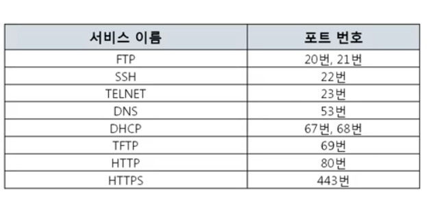
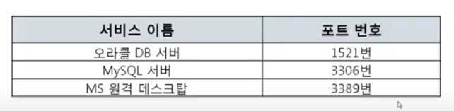

4계층은 전송계층(Transport layer)로서 송신자의 프로세스와 수신자의 프로세스를 연결하는 통신 서비스를 제공한다. 전송계층은 연결지향 데이터 스트림 지원, 신뢰성, 흐름제어, 다중화와 같은 편리한 서비스를 제공한다.

전송 프로토콜 중 가장 잘 알려진 것은 연결지향방식을 사용하는 `TCP`(Transmission Control Protocol) 프로토콜이다. 단순한 전송에 사용되는 `UDP`(User Datagram Protocol) 프로토콜도 있다.

TCP는 안전한 연결을 지향하고, UDP는 안전한 연결을 지향하지 않는다

- `프로세스`: 메모리에서 실행중인 프로그램

## Port

- 특정 프로세스와 특정 프로세스가 통신하기 위해 사용한다.  
- 하나의 포트는 하나의 프로세스만 사용가능하다, 하나의 프로세스가 여러 포트를 사용하는 것은 가능하다  
- 포트번호는 일반적으로 정해져 있지만, 변경 가능하다(보통 웹서비스는 80이지만 꼭 80번을 사용해야 하는것은 아님)  

## Well-known Port

## Registered Port

공신력 있는 기관에서 등록해둔 포트번호

## Dynamic port

보통 클라이언트 들이 아래의 포트중 하나를 사용하여, 서버의 포트와 통신하게 된다(웹서비스의 경우 보통 서버의 80, 443포트)

### 49152 ~ 65535