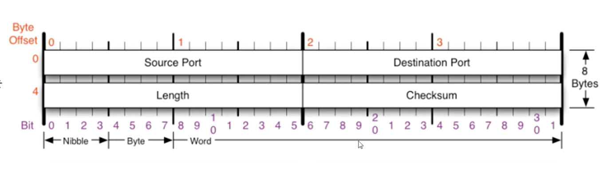

- 사용자 데이터그램 프로토콜(User Datagram Protocol), 유니버셜 데이터그램 프로토콜(Universal Datagram Protocol)로도 불린다
- 서비스 방식이 너무 단순해서 순서가 바뀌거나 중복되거나 누락되기도 한다. 검증이나 재전송 요청도 없다 ⇒ `신뢰성이 낮음`
- 따라서 UDP는 `특수한 경우`(오류의 검사와 수정이 필요없는)에만 사용되는것으로 가정한다

## 사용예시

- 영상 스트리밍(영상의 한두프레임이 빠져도 큰 문제가 되지 않음)
- DNS서버
- RIP 프로토콜(라우팅 정보 공유)