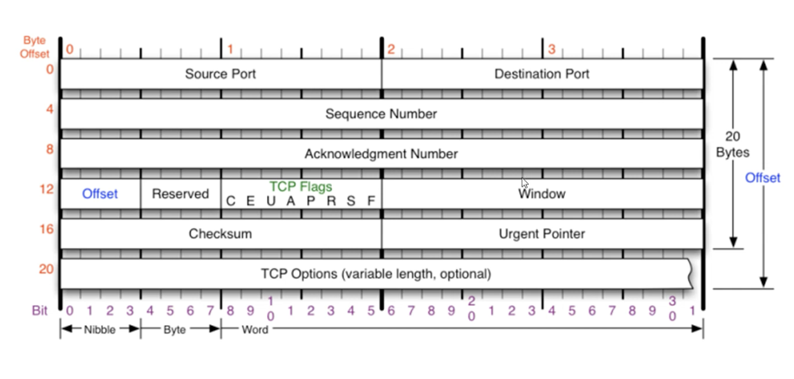
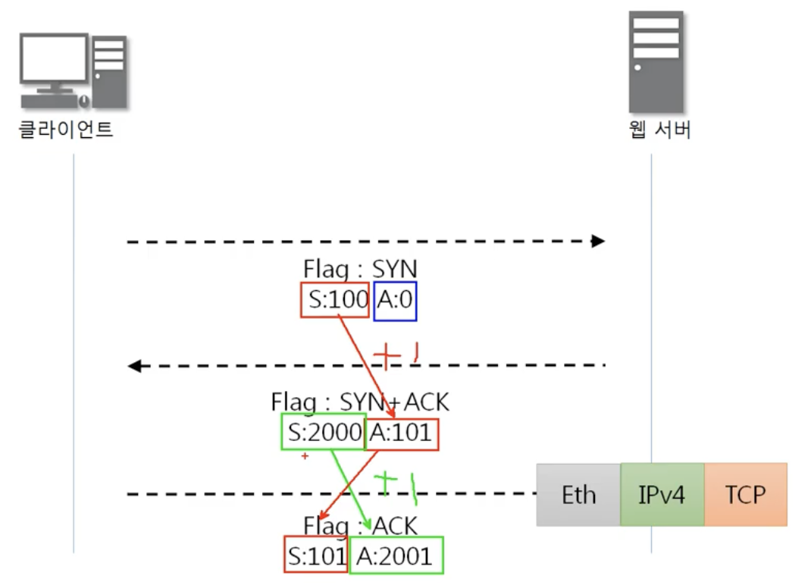
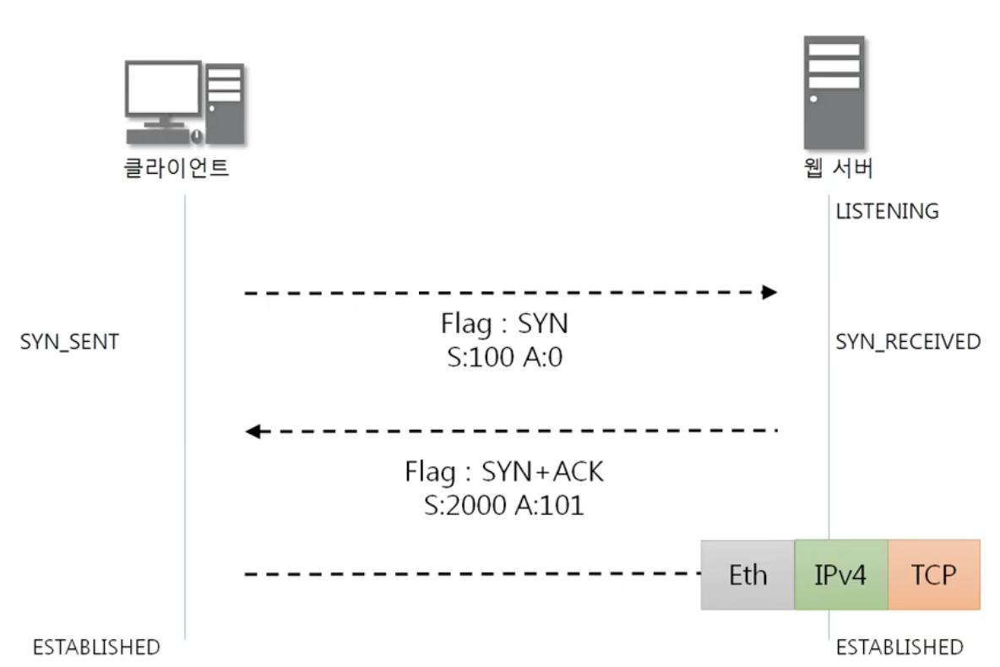

- TCP는 인터넷에서 연결된 프로세스 간의 통신을 안정적으로, 순서대로, 에러없이 교환할 수 있게 한다
- TCP는 UDP보다 안전하지만 느리다

## TCP flags

한번에 여러개의 flag를 설정할 수 있다

- U(Urgent)
- **A(Acknowledgement)**
승인
- P(Push)
- **R(Reset)**
연결 새로고침
- **S(Syn)**
동기화(연결시작시 사용됨)
- **F(Fin)**
종료

## 3way Handshake

1. 클라이언트가 서버에게 연결요청 패킷 전송
2. 서버가 클라이언트의 요청을 승인하는 패킷 전송
3. 클라이언트가 최종적으로 수락하는 패킷 전송

## State transition

