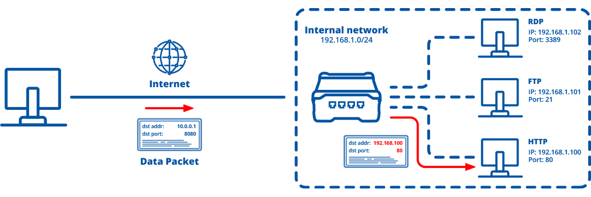

# NAT(Network Address Translation)

특정 `ip주소`의 특정 `port`로 가는 패킷을 다른 `ip주소`의 다른 `port`로 바꿔주는 것이다. 패킷에 변화가 생기기 때문에 IP나 UDP|TCP의 checksum도 다시 계산되어 재기록 한다

NAT를 이용하는 이유는 대개 사설 네트워크에 속한 여러개의 호스트가 하나의 공인IP를 사용해 인터넷에 접속하기 위함이다

포트포워딩만을 위한 기술은 아니다

# Port forwarding

패킷이 라우터나 방화벽 같은 네트워크 장비를 지나는 동안 ip주소와 포트번호를 바꿔주는 NAT기술의 응용이다. 이 기술은 게이트웨이(외부망)의 반대쪽에 있는 `사설 네트워크에 있는 호스트`에 대한 서비스를 생성하기 위해 사용된다. 

포트관련 테스트 할 때는 `방화벽`을 끄는것이 좋다. 방화벽은 기본적으로 모든 포트번호를 막아둔다