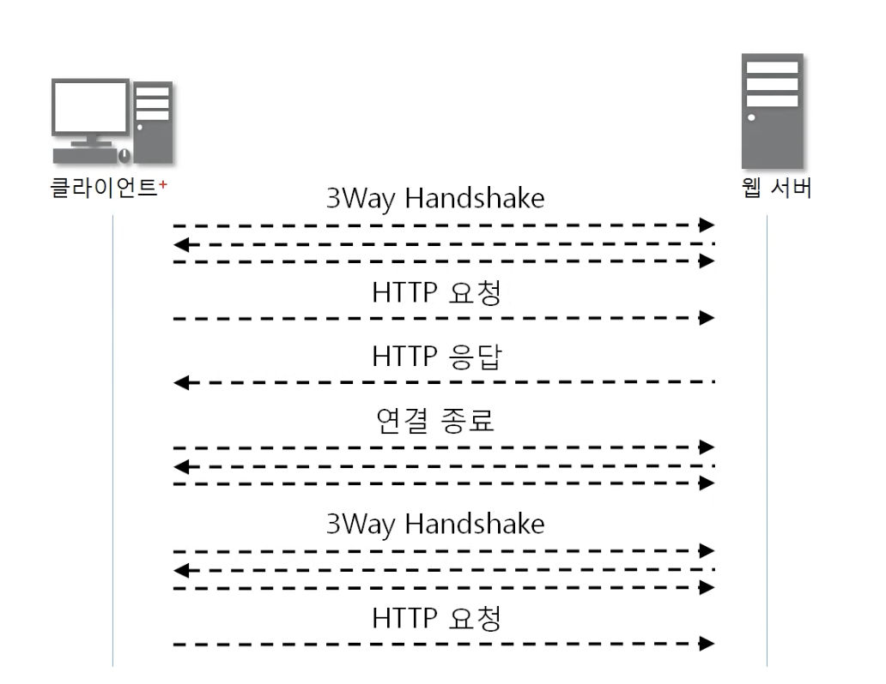
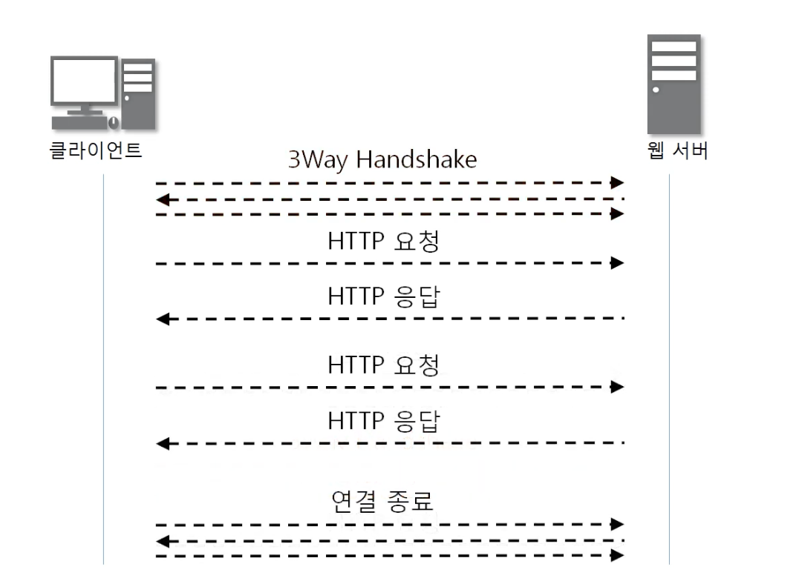
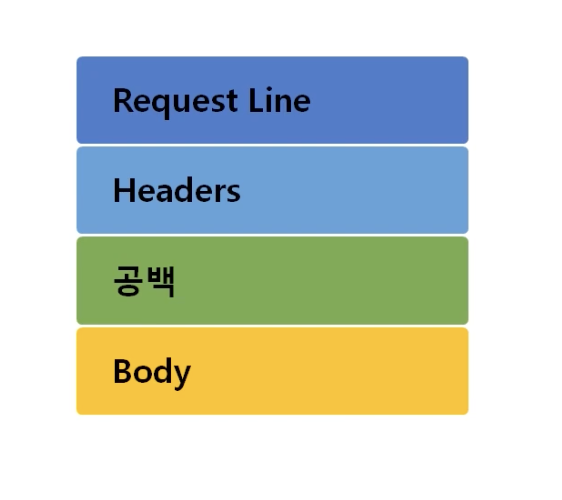
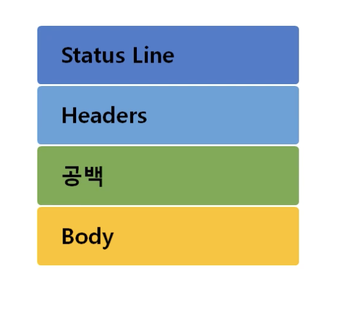
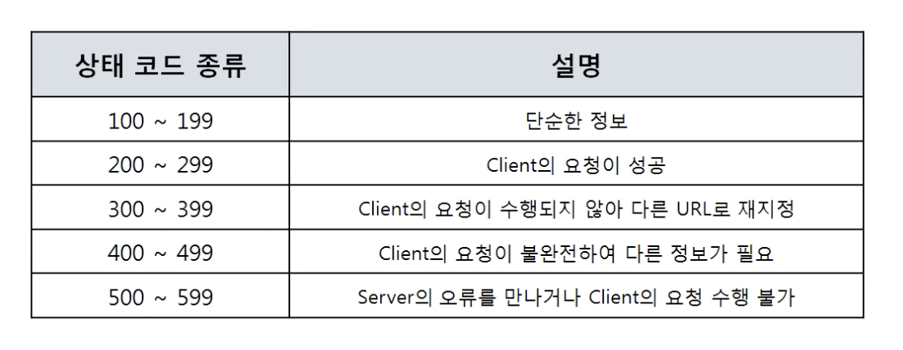
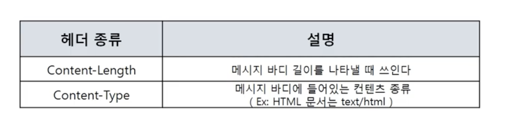
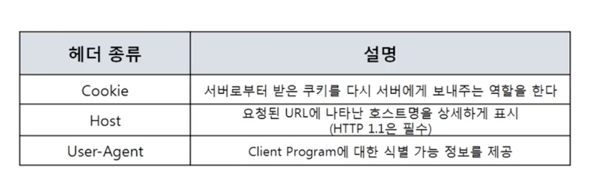
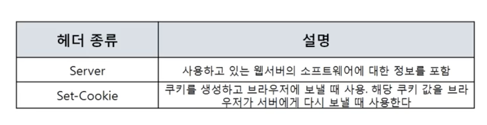

## HTTP(HyperText Transfer Protocol)

- www에서 쓰이는 핵심 프로토콜로, 문서의 전송을 위해 쓰이며, 거의 모든 웹어플리케이션에서 쓰이고 있다(음성, 화상 등 여러종류의 데이터를 MIME으로 정의하여 전송 가능)
- Request / Response에 기반하여 서비스 제공

## HTTP/1.0

1.0버전은 한번의 요청/응답 후 연결을 끊는다

연결수립 ⇒ 동작 ⇒ 해제

매번 연결과 해제를 하기 때문에 통신부하가 발생한다(하나의 url은 한번의 TCP연결)

## HTTP/1.1

1.1버전은 모든요청/응담 후 연결을 끊는다

1.0과 호환가능

Client의 요청이 많을경우 Pipeline형식의 Request / Response제공(연속적인 응답)

1.0과 달리 하나의 서버 ip주소에 여러 website가 연결가능

Cache사용, Data압축 가능

# Request protocol

## Request line

- 요청타입
    
    method(get, post, put, delete…)
    GET과 POST는 같은 역할을 할수 있지만 데이터의 공개가능 여부에 따라 구분되어 사용된다. 
    GET은 URI에 데이터를 포함시키고, POST는 body에 포함시킨다(https를 이용해 body의 데이터를 가린다)
    
- URI
`scheme://host[:port][/path][?query]`
인터넷 상에서 특정 자원을 나타내는 유일한 주소
서버에 있는 자원의 주소와 `보내려는 데이터값`을 포함한다
- HTTP 버전
1.1

# Response protocol

## Status line

- 상태코드 대분류

# Header

## 일반헤더(일반적인 정보를 담고있다)

## 요청헤더

- `User-Agent`를 통해 모바일인지, PC인지, 운영체제 및 브라우저 정보를 알 수 있다

## 응답헤더

- Server: 웹서버가 어떤종류인지 알려준다. 정보보호를 위해 노출시키지 않을 수도 있다