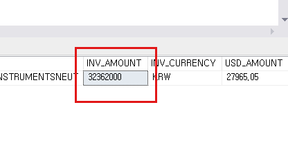
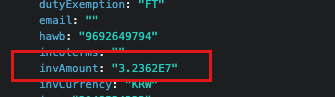

DB에서 float형 데이터를 받아오는 과정에서 일정금액 이상이 되면 지수형태로 숫자를 표현하는것을 확인했다.  
다시 값을 넘겨주는 과정에서 문제가 발생하여 DB그대로 값을 가져오는 부분을 추가했다.

```sql
// 금액 float -> string 변환
REPLACE(CONVERT(VARCHAR, CONVERT(MONEY, d.inv_amount), 1), '.00', '') AS inv_amount
```

인터넷을 찾아보니 다른방법도 있는듯 하다  

## [Ref](https://arranging.tistory.com/213)

