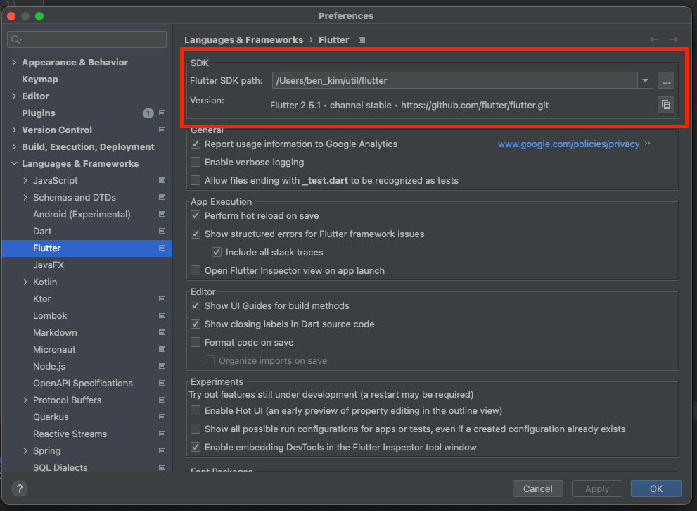

FVM(Flutter Version Management) Flutter SDK버전을 쉽게 바꿀수 있도록 도와주는 패키지이다. 

## 설치 
```
brew tap leoafarias/fvm
brew install fvm
```

## 사용법
```
fvm releases // 출시된 SDK목록 조회
fvm install VERSION_NUM // 해당버전 설치
fvm list // 설치된 버전 목록 조회
fvm use VERSEION_NUM // 해당버전 프로젝트내 사용
```

> 설치후 기존 flutter 명령어 앞에 fvm을 붙여 사용한다 
fvm flutter --version

## IDE에서 직접 바꾸는 경우
Preferences > Languages & Frameworks > Flutter  


## Ref
- [참고](https://velog.io/@kimbiyam/Flutter-fvmFlutter-Version-Management-사용하기)