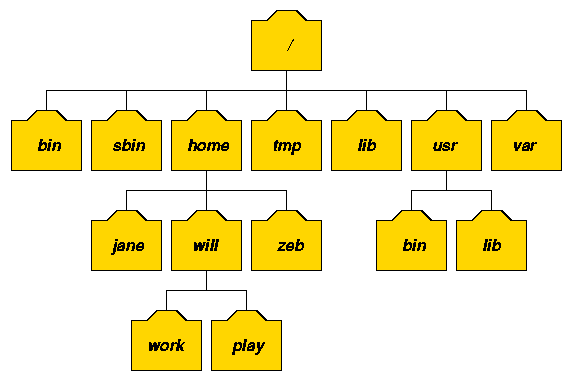

리눅스에서는 `디렉토리` 윈도우에서는 `폴더`

디렉토리/폴더 구분을 리눅스에서는 `/` 윈도우에서는 `\`

## /

최상 디렉토리, 절대경로를 표기할 때 여기부터 시작

## /bin

`mv, cp, rm`와 같은 기본적인 명령어가 저장된 디렉토리

## /sbin

`ifconfig, e2fsck, ethtool, halt` 와 같은 시스템 관리자용 명령어가 저장된 디렉토리

## /etc

시스템의 설정파일이 저장된 디렉토리

## /home

사용자의 홈디렉토리, `useradd`로 사용자를 생성하면 이곳에 같은이름의 디렉토리가 생성됨 

## /tmp

시스템을 사용하는 모든 사용자들이 공동으로 사용하는 디렉토리

- 소켓파일
- 세션파일
- 웹해킹에 사용되기에 주의

## /lib

커널모듈파일, 라이브러리파일들이 저장된 디렉토리

## /usr

일반 사용자들이 사용하는 디렉토리

`c++, chsh, cpp, crontab, du, find`등 일반사용자 명령어는 /usr/bin에 위치한다

## /var

시스템 운용중에 생성되었다가 삭제되는 데이터들을 일시적으로 저장하기 위한 디렉토리

- `/var/log` 시스템 로그파일
- `/var/named` DNS의 zone 설정파일
- `/var/spool/mail` 메일파일
- `/var/spool/cron` 크론설정파일