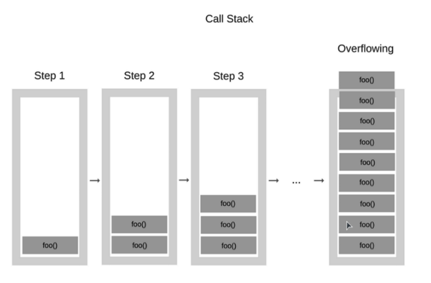
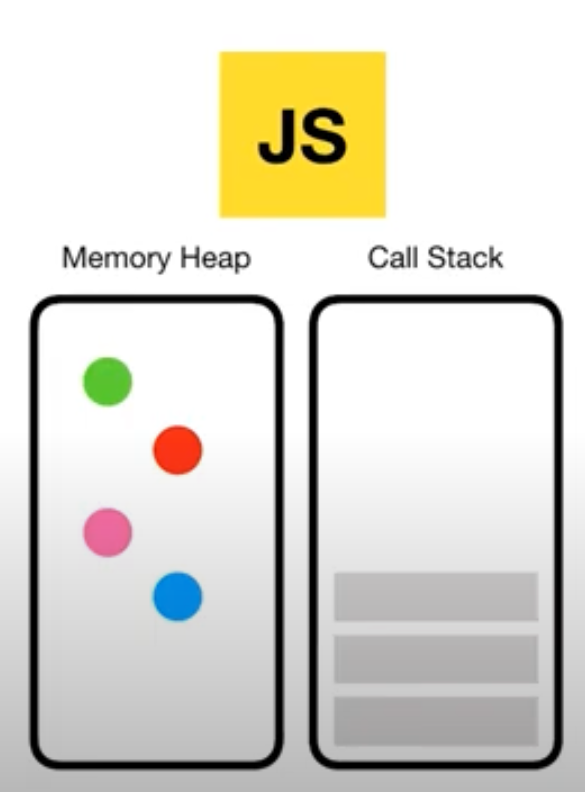
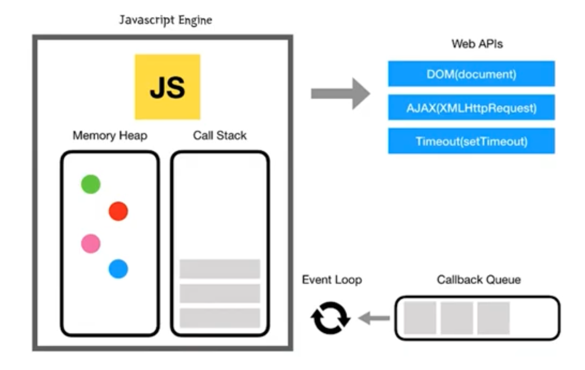

# Javascript is a `single threaded` language that can be `non-blocking`

- 자바스크립트는 하나의 Call Stack을 가지고 있다(한번에 하나의 작업만 수행할 수 있다)  
Call Stack: 프로그램에서 우리가 어디에 있는지를 기본적으로 기록하는 데이터 구조  

- 자바스크립트는 비동기처리가 가능하다  
  - 동기: 코드를 차례대로 실행하며 현재 코드가 완료되지 않으면 다음으로 넘어가지 않는다  
  - 비동기: 현재 코드가 완료되지 않더라도 멈추지 않고 다음 코드를 실행시킨다
    

## synchronous / Asynchronous

- 동기는 `전화`와 비슷하다. 전화를 걸고 받을때까지 대기한다.
- 비동기는 `문자`와 비슷하다. 문자를 보내고 답장이 올때까지 다른일을 한다.

> 브라우저에서는 다양한 작업들이 일어나게된다.  
> 그런데 만약 동기적으로 실행된다면 무거운 작업(이미지 로딩, 네트워크 요청 등)이 실행할때 브라우저는 `먹통`이 되어버린다.   
> 그래서 비동기적으로 `멈추지 않고` 작업들을 수행하는 것이 사용자 경험에 좋다.

# JS engine

자바스크립트 엔진은 코드를 해석하고 실행하는 인터프리터 역할을 한다.

브라우저별 다른 엔진을 사용한다. ex) 사파리는 webkit, 크롬은 V8

- Memory Heap(힙): 메모리 할당이 이루어지는 부분(변수, 객체 등이 저장되는 창고)  
- Call Stack(호출스택): 함수가 호출되는 순서대로 쌓이는 스택  

# JS Run-time Environment

자바스크립트는 이벤트 루프를 이용해 `비동기 방식으로 동시성을 지원`한다.  

1. 코드 실행중 Web API를 호출하는 만나게되면(DOM이벤트, Ajax, Timeout), 이를 Web API에 `위임`한다.
2. Web API메소드들이 작동을 마치면서 반환하는 `콜백 함수`를 Callback Queue에 추가한다
콜백함수: 다른함수의 인자로 넘겨지는 함수
3. `Event Loop`는 Call Stack과 Callback Queue를 주시하고 있다가 Call Stack이 비어있으면 Callback Queue에 있는 콜백함수들을 Call Stack으로 이동시킨다(`Call Stack이 비어있는 경우에만`)