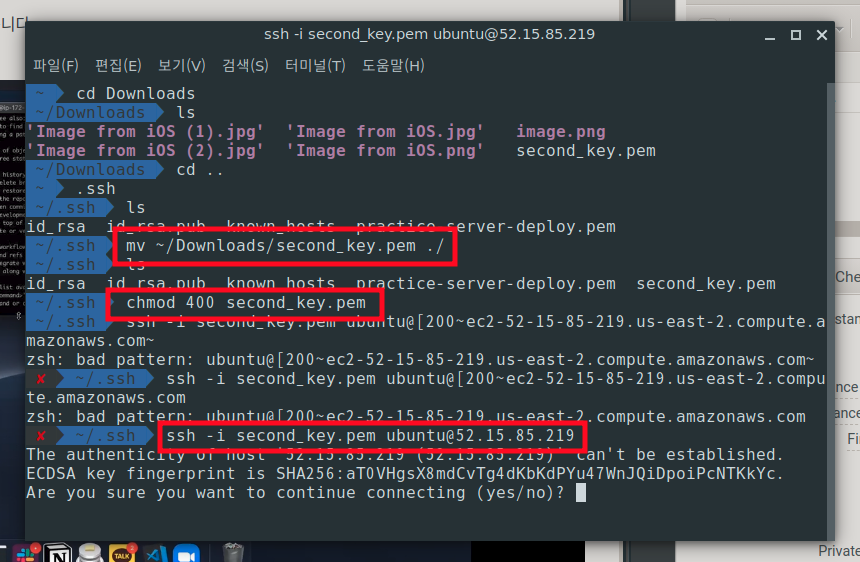

1. pem키 다운로드  

2. `~/.ssh` 디렉토리로 이동(없으면 생성)  

3. `mv ~/download/key.pem ~/.ssh`   다운로드받은 key파일을 ssh디렉토리로 이동  

4. `chmod 400 key.pem` 권한설정  

> ### 사용자 권한 설정  
> chmod [User] [Group] [Others]  
> 0: 권한없음  
> 1: 실행  
> 2: 쓰기  
> 4: 읽기  
> EX) `chmod777`: 모든사용자 모든권한  

5. `ssh –I second_key.pem [ubuntu@52.15.82.219](mailto:ubuntu@52.15.82.219)`(public id) 접속  
