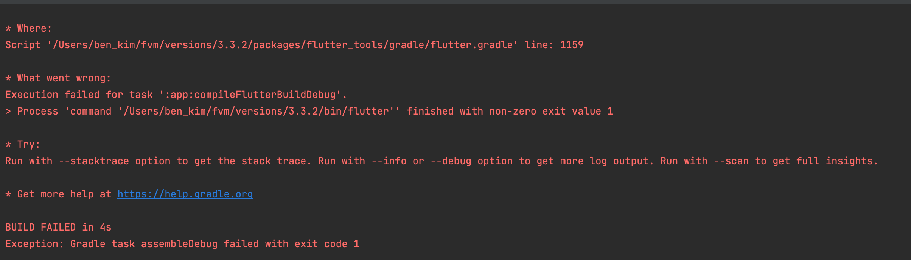

1. fvm으로 최신의 stable한 버전으로 변경

2. gradle 버전확인
    - 해당 플러터 버전으로 새로운 프로젝트를 만든뒤, 사용된 gradle버전을 확인한다
3. pubspec.lock 제거

4. updated 된 패키지 업데이트
   
```
flutter pub outdated
flutter pub upgrade --major-versions
```

5. clean 후 패키지 재설치
```
flutter clean
flutter pub get
```