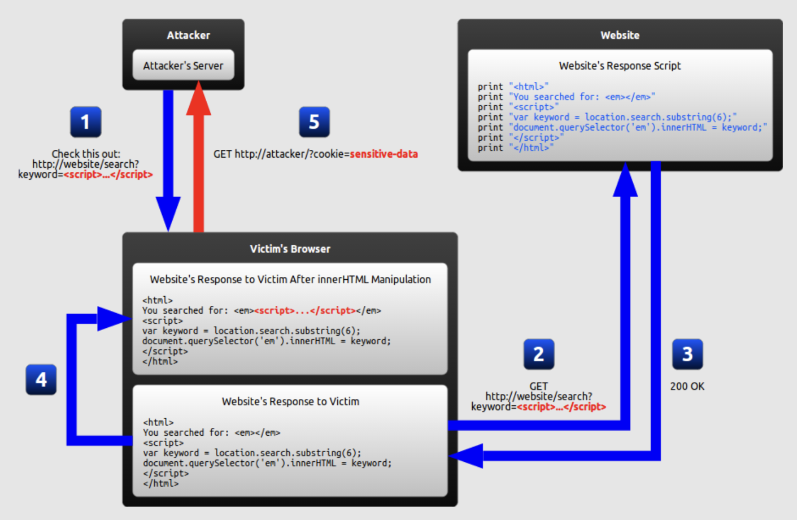
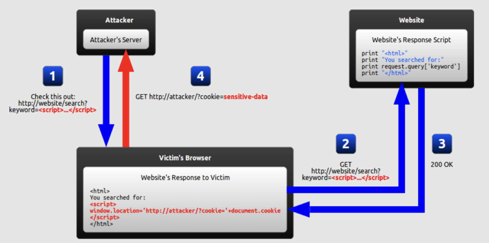
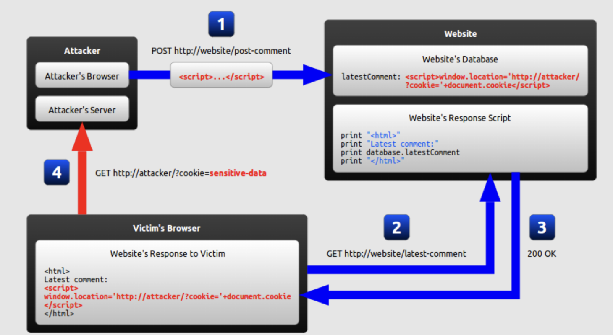

# Overview
- XSS is a type of script injection
- Attacker use a web applicaiton to send malicious code
  
# Types
## 1. DOM-based XSS

- Attacker send a sciprt tag through DOM and the script run when server response this DOM

## 2. Reflected XSS

- Attacker's payload becomes a part of the request goes to the webserver, then it is reflected back in response include the payload from the request
  
## 3. Stored XSS

- Attacker inject malicious script in vulnerable web application's database. and the script run when user load data

