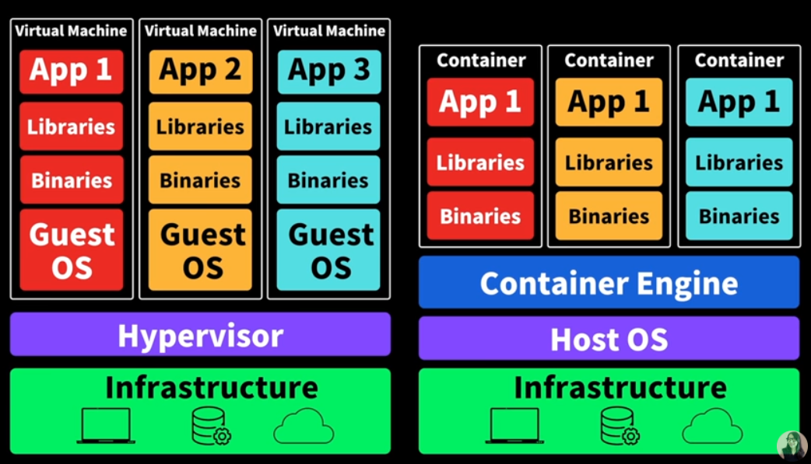

## Docker

> Docker is a software platform that allows you to build, test, and deploy applications quickly. Docker packages software into standardized units called containers that have everything the software needs to run including libraries, system tools, code, and runtime. Using Docker, you can quickly deploy and scale applications into any environment and know your code will run.

- 운영체제에 따라 환경이 다르다. 각 다른 환경에서는 배포과정에서 오류가 생기기 쉽다
- 개발, 배포환경을 통일시킬 수 있다(개발이 docker환경에서 이루어지면 배포가 더 쉬워진다)
- 배포과정에서 docker를 활용하면 동일한 환경을 가질 수 있다
- **Docker File**을 이용해 디펜던시, 모듈등을 미리 다운받을 수 있다(설정의 번거로움 해결)
- 어플리케이션을 구동하기 위한 모든것을 컨테이너에 담아둔다

## Docker vs. Virtual Machine



- VM은 운영체제 위에서 운영체제를 실행하기 때문에 무겁다
- Docker는 운영체제의 핵심 기능(커널)을 공유하는 가상 머신으로 (커널 ex 마우스, 프린터...) OS 전체를 새로 설치하는 VM에 비해 가볍다
- 컨테이너가 구동되기 위해서는 컨테이너 엔진이 필요하고, 가장 많이 사용되는것이 Docker이다

## 설치

[https://docs.docker.com/get-docker/](https://docs.docker.com/get-docker/)

## 명령어

### image 리스트 확인

```bash
docker images
```

### hub에서 이미지 다운로드

```shell
docker pull NAME-OF-IMAGE
docker pull vulnerables/web-dvwa
```

### 실행

```bash
# 1. 처음 실행
docker run -p 8080:80 vulnerables/web-dvwa

# 1) running the DVWA image
# 2) expose port 8080 externally 
# 3) mapped to port 80 inside the container
# 4) localhost:8080
# This will create a new container of the DVWA.

# 2. 중지된 컨테이너 실행
docker start -ai [container ID or container Name]

# 1) start already existing container (which is currently stopped)
# 2) -a means Attach STDOUT/STDERR and forward signals
# 3) -i means Attach container's STDIN.
```

### 모니터

```bash
# check container(name of the container is randomly generated)
docker ps # (running containers)
docker ps -a # (all containers)
```

### 종료

```bash
docker stop [container ID or container Name]
```

### Ref

- [https://www.youtube.com/watch?v=LXJhA3VWXFA](https://www.youtube.com/watch?v=LXJhA3VWXFA)
- [https://docs.docker.com/engine/reference/builder/](https://docs.docker.com/engine/reference/builder/)
- [https://docs.docker.com/develop/develop-images/dockerfile_best-practices/](https://docs.docker.com/develop/develop-images/dockerfile_best-practices/)