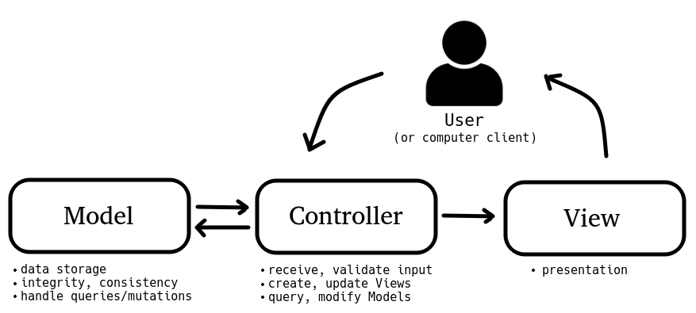

- 코드가 커지면 하나의 파일안에 UI와 비즈니스 로직이 엉켜서 가독성이 떨어지게 된다
- 유지보수 및 가독성을 위해 UI와 로직을 분리하는 디자인패턴을 사용한다
- 플러터는 가장 작은 단위인 위젯안에 UI와 컨트롤러가 공존하기 때문에 MVC패턴을 쓰기 적합하지 않다. 하지만 MVC패턴을 이해해야 이후에 이를 보완해 나온 패턴들을 이해하기 수월하다

1. 사용자의 요청 or 이벤트가 Controller에 도착
2. Controller 요청에 맞는 데이터를 Model에게 요청(model의 메소드 호출)
3. Controller가 변경된 데이터에 맞는 새로운 View에게 제공
4. View는 Controller를 통해 주입된 data에 맞는 새로운 UI를 유저에게 제공

## Model

- 데이터, 데이터를 처리하는 로직
- 데이터와 데이터를 가공하는 메소드는 같이 있다 . 컨트롤러는 호출만 할 뿐
- View와 Controller에 의존하지 않는다

## View

- 화면
- 데이터를 따로 저장하지 않는다
- 컨트롤러를 통해 data를 주입받는다

## Controller

- Model과 View을 이어주는 부분
- 사용자의 이벤트를 받아 그에 맞는 데이터 가공을 Model에게 요청하고, 그에맞는 새로운 View를 제공한다

## Rule

1. Model은 Controller와 View에 의존하지 않는다(데이터 관련 코드만 관리한다)
2. View는 Model에만 의존해야하고 Controller에는 의존하지 않는다
3. View가 Model로부터 데이터를 받을 때는 사용자별로 다른 데이터만 받아서 보여준다
4. Controller는 View와 Model에 의존해도 된다
5. View가 Model로부터 데이터를 받을 때 Controller를 통해 받는다

## Ref
https://youtu.be/ogaXW6KPc8I