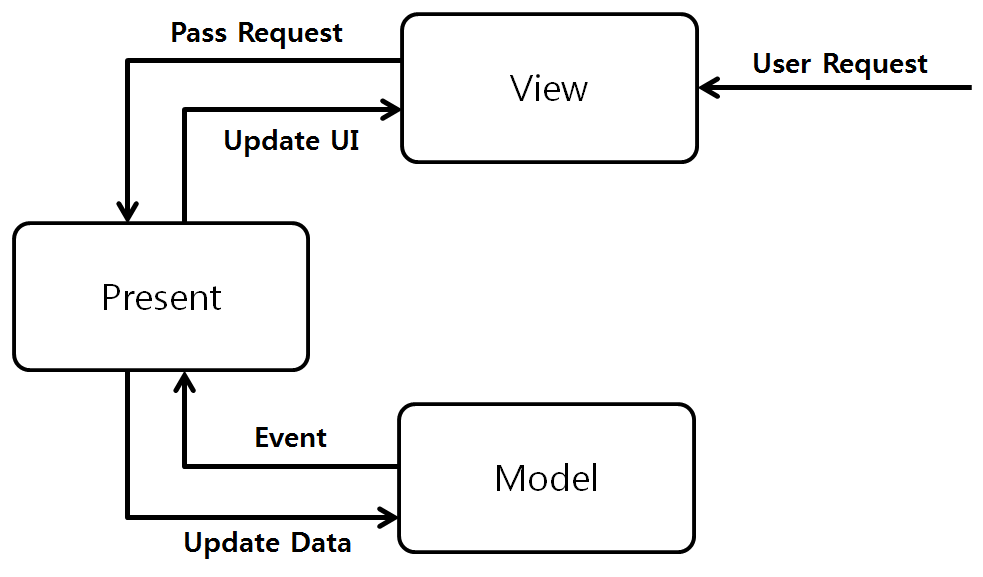

View 와 Model 의 결합도가 높다는 MVC 패턴의 문제점을 보완하기 위해 만들어진 것이 바로 MVP 패턴이다.

MVP 패턴은 View 와 Model 이 **Presenter 를 통해서만 동작**할 수 있도록 하여, View 와 Model 의 의존성을 제거한 디자인 패턴이다.

Presenter는 Model에서 받아온 데이터를 가공해 View에게 전달한다. 이 과정에서 민감한 정보 등을 필터할 수 있다.

## 특징
- 유저의 입력을 받는 컨트롤러가 view에 있다(MVC에서는 controller에 존재하는 것과 비교됨)
- View와 Presenter는 1:1 관계이기 때문에 프로젝트 규모가 커질수록 파일 수가 많아짐
- 기능 추가시 인터페이스 까지 손봐야 하기 때문에 작업량이 많아짐

## ref
- [https://magi82.github.io/android-mvc-mvp-mvvm/](https://magi82.github.io/android-mvc-mvp-mvvm/)

- [https://www.youtube.com/watch?v=bjVAVm3t5cQ&ab_channel=곰튀김](https://www.youtube.com/watch?v=bjVAVm3t5cQ&ab_channel=%EA%B3%B0%ED%8A%80%EA%B9%80)

- [https://salix97.tistory.com/205](https://salix97.tistory.com/205)